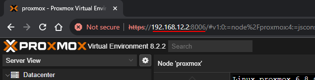
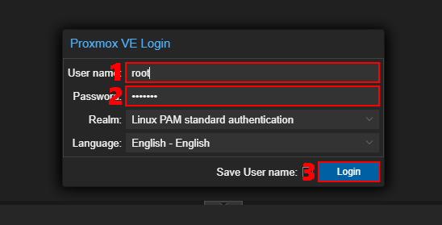
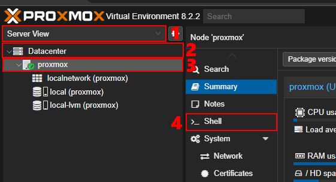
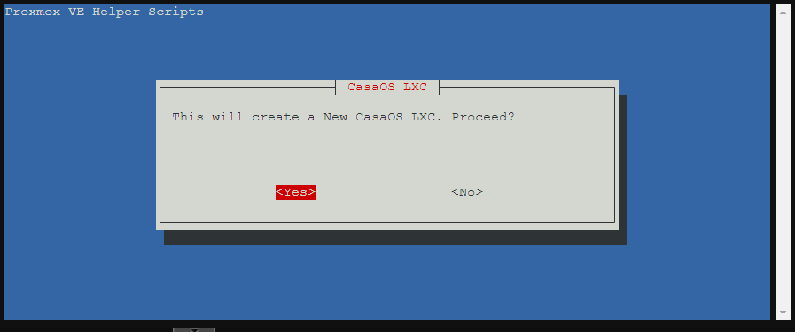
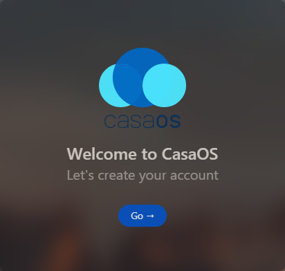
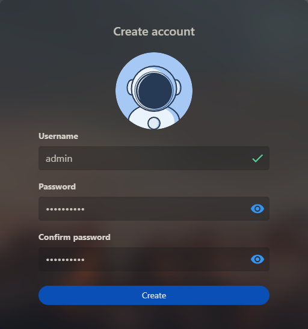
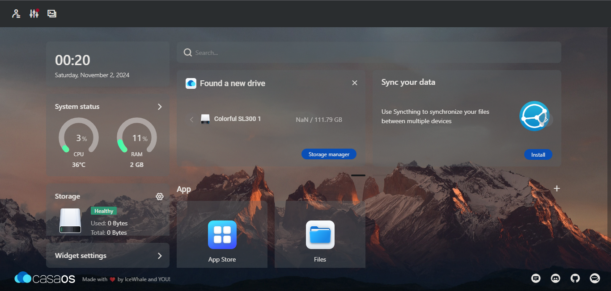
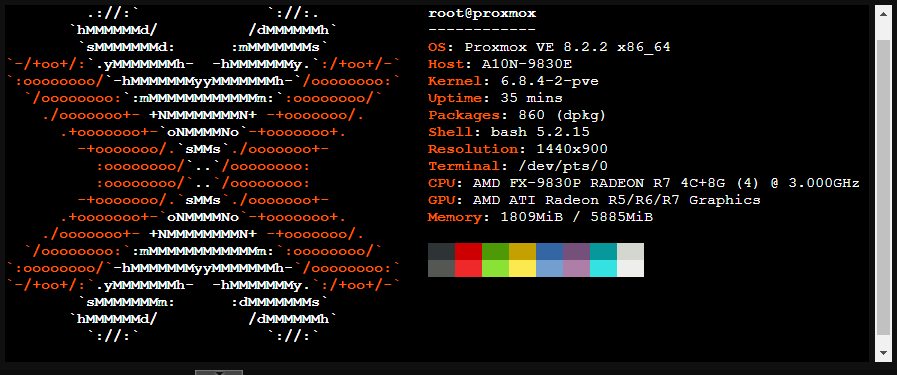

# Langka - Langkah Installasi

- Pertama pastikan Proxmox di bare metal kalian sudah menyala dan terhubung ke internet </br>
- Buka IP Proxmox kalian pada browser apapun </br>
 </br>
- Kemudian login menggunakan akun yang sudah kalian buat </br>
 </br>
- Setelah selesai login pada **Search View** kemudian pilih **Datacenter** klik **VM** yang kalian buat dan pilih **Shell** </br>
 </br>
- Kemudian kalian kunjungi https://tteck.github.io/Proxmox/ pilih **Docker - Kubernetes** --> **CasaOS LXC** --> ***Copy** atau kalian bisa copy perintah di bawah ini </br>
```bash
bash -c "$(wget -qLO - https://github.com/tteck/Proxmox/raw/main/ct/casaos.sh)"
```
- Setelah selesai di copy pastekan pada Shell di Proxmox kalian </br>
- Setelah di tekan Enter nanti akan muncul `Proxmox VE Helper Scripts` setelah muncul `This will create a New CasaOS LXC. Proceed?` pilih **Yes** </br>
 </br>
- `Use Default Settings?` ada dua opsi di sini jika kalian ingin mengikuti konfigurasi bawaan pilih **Yes** jika tidak pilih **Advanced** untuk menyesuaikan kebutuhan kalian </br>
 </br>
- Tunggu beberapa saat jika berhasil akan muncul IP untuk membuka **CasaOS** kalian </br>
- Setelah muncul ip pada Shell pastekan di Tab baru pada browser kalian </br>
 </br>
- Masukan akun baru sebagai admin atau ID yang kalian inginkan </br>
 </br>
- Setelah membuat akun selamat... kamu sudah memasuki tampilan awal dari CasaOS yang di install pada Proxmox </br>
 </br>

# Troubleshooting ( Pemecah masalah )
Jika kalian gagal membuka IP CasaOS saya rasa ada ketergantungan paket yang kurang dan untuk melengkapinya jalankan perintah di bawah ini </br>
```bash 
nano /etc/apt/sources.list.d/ceph.list
#deb https://enterprise.proxmox.com/debian/ceph-quincy bookworm enterprise (beri # pada awal repositori) 
```
```bash
nano /etc/apt/sources.list.d/pve-enterprise.list
#deb https://enterprise.proxmox.com/debian/pve bookworm pve-enterprise (beri # pada awal repositori) 
```
```bash
nano /etc/apt/sources.list
# Proxmox VE pve-no-subscription repository provided by proxmox.com
deb http://download.proxmox.com/debian/pve bookworm pve-no-subscription
```
Alternatif jika tidak bisa menggunakan wget
```bash
curl -fsSL https://get.casaos.io | bash
```

# Informasi Spesifikasi Perangkat Keras



# Credits
Download Proxmox disini : [proxmox-ve_8.2-2.iso](https://www.proxmox.com/en/downloads/proxmox-virtual-environment/iso) </br>
Download CasaOS disini : [casaos_v0.4.13](https://github.com/IceWhaleTech/CasaOS/releases/tag/v0.4.13) </br>

<div align="center">  </div>
